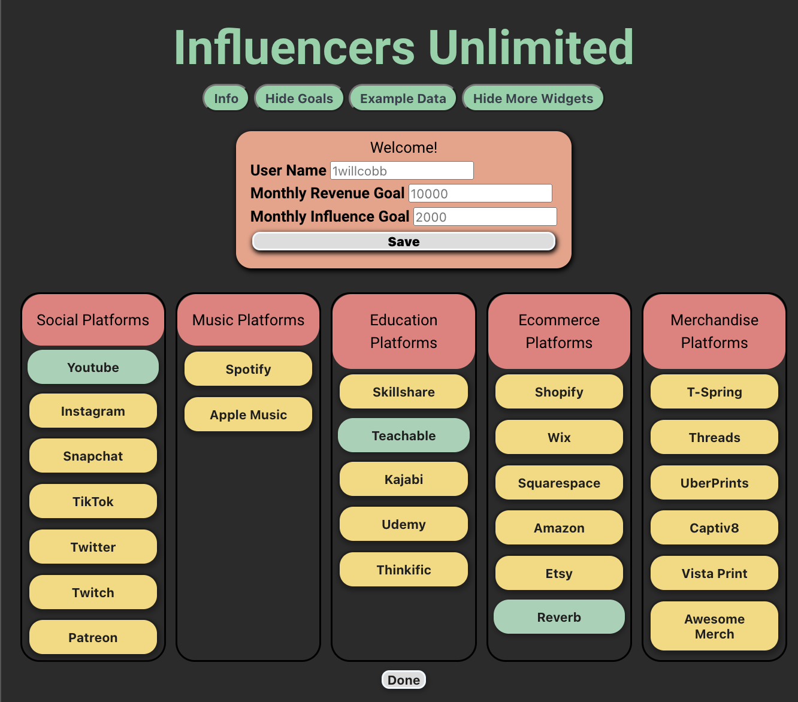

# Influencers Unlimited

The Influencers Unlimited App is an app to manage a Creator's cross platform influence and financial management.

## Group Rolls

* Will: Project Lead (logic development, data structure)
* Bryce: Software Developer (API Research, framework, Bulma implementation, CSS-styling)
* Jared: Quality Control (API Research, styling, presentation polishing, display formatting)
* Clayton: Scrum Master (API Research, Eventlistener implementation, CSS-styling )
* Lars: Compliance Officer (logic development, troubleshooting, API Research,)

## Project Presenters

* (Jared) Elevator pitch: A one-minute description of your application.
* (Clayton) Concept: What is your user story? What was your motivation for development?
* (Will) Process: What were the technologies used? How were tasks and roles broken down and assigned? What challenges did you encounter? What were your successes?
* (Bryce) Demo: Show your stuff!
* (Lars) Directions for future development.

## The Problem

Creators post their content and utilize multiple platforms while only having access to 1 at a time, or multiple windows open to see and track all their data at once. 
What if there was one place they could access their metrics, track and manage their income, and budget and set goals for managing their monthly finances and the future of their career. 

## Project Description

As a Creator making content and operating your brand across many platforms, you may have a hard time aggregate your data in one place to see how well you are doing financially and influentially. Influencers Unlimited is here to help. Now you can aggregate your data in one place and set goals you want to strive for monthly. 

When you first open the app you are greated with instructions

Then you will need to set you NAME, REVENUE GOAL, and INFLUENCE goal before progressing. You can go back to these goals any time while using the app with the “Set Goals” button.

Then, Choose a platform you would like your data to be tracked on. (Currently available widgets are highlighted in green). 

Input the required API or User Name request and hit Done. 

This will save your access to that platform and if the information is correct, a new widget will appear with your data. 

Press the “Add More Widgets” button to add more platform widgets to your dashboard. 

If you are testing out the platform and do not have, or wish to put in your own info. Hit the “Example Data” button to input data from a few example creators. 

You will see a comparison graph called “Monthly Goals” update with your goals compared to the data gathered from the platforms you have chosen and you will see widgets below that show more data on your desired platforms.

## Project Future

* There are many more platforms we want to get operational so we will continue to discovered and utilize these new platforms and APIs. 

* We would like to compare more data in the main data and goal setting display. As well as display individualized platform goals and charts. 

* The design is simplistic at the moment and we would love to add further design elements.

## Platforms considered

### Social

* Facebook
* Instaragram
* TikTok
* Twitter (paid)
* YouTube * ACTIVE
* Twitch
* Snap chat
* Patreon

### Music

* Spotify
* Apple Music

### Courses

* Teachable
* Kajabi
* Skillshare
* Udemy
* Thinkific 

### E-Commerce

* Shopify
* Wix
* Squarespace

### Merchendice

* T-Spring
* Threads
* UberPrints
* Captiv8
* Vista Print
* Awesome Merch

## Competition

Platforms like social blade[https://socialblade.com/youtube/c/1willcobb] and VidIQ [https://vidiq.com/] both leverage the YouTube API and parse comparisons. They also use key word searching with potentially the google search API. But they both are generally single platform and don't let you aggregate multi platform or finances. 

## Design Concepts

[Figma](https://www.figma.com/file/Fmx1sUAOSJZDFFbjr8eenN/%22App-Name-Here%22---Project-1-Group-Project?type=design&node-id=0%3A1&t=8fKFVH06Jsgbxh1K-1)

## Demo Images

## GitHub Repository

[repo](https://github.com/Claytonlax/Creator-App-2)

## Live Site

[Influencers Unlimited](https://claytonlax.github.io/Creator-App-2/)

